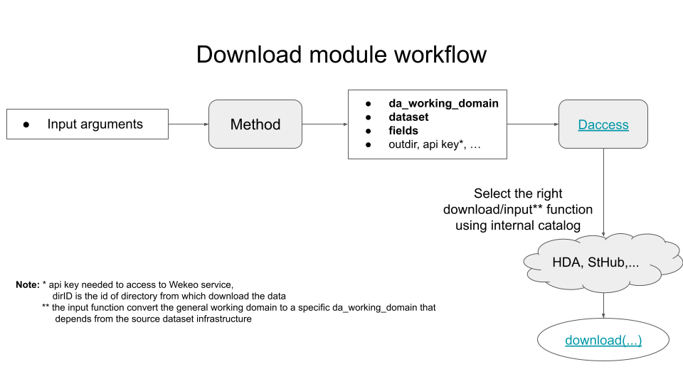

# Daccess
## General multi-platform download API

Daccess is python module that allow the download from 
different infrastructures using always the same interface.
It creates a layer between our method and the infrastructure 
where the files are stored in order to make transparent the download
of data.

Currently it supports the download from two different infrastructures:

1. StorageHub Facility (d4science service,  https://dev.d4science.org/)
2. Harmonised Data Access (HDA, https://www.wekeo.eu/docs/harmonised-data-access-api)





## Working Domain

When download data, it's important to specify the desired working 
domain, in order to download only the necessary data.
Some service like HDA supports the 
sub-setting of the domain, it means that the download file will
contain only the region indicated in the working domain.

Each infustrucure require a different format for the working domain.
The formatting of the working domain in accordance with the 
specifications of the specific infrastructure will be performed automatically.

To optimize the conversion process, daccess defines its own specification for the working domain to receive as input from the user:

```json
{
    "lonLat": ["minLon", "maxLon", "minLat", "maxLat"],
    "depth": ["minDepth", "maxDepth"],
    "time": ["minTime", "maxTime"]
}
```

Some remarks:

- lonLat and depth are expressed as list of int/float
- time is a time interval, the time is expressed as a string using ISO format: **YYYY-MM-DDThh-mm-ss**


## How it works

Download interface [(go to file)](interface/idownload.py):

```python
def download(self, dataset, working_domain, fields,
            in_memory=False, rm_file=True, max_attempt=5, return_type="netCDF4")
"""
    Args:
        dataset: source dataset
        working_domain: dict with spatial/time information, each strategy defines its own format
        fields: field/s desired (is recommended to use cf_standard_name)
        in_memory: if True, try to download the file directly in memory -> it's not fully supported
        rm_file: if True, remove file from disk after load it in memory
        max_attempt: maximum number of download attempt in case of errors
        return_type: string used to select the output type, it can be netCDF4 o str
                    if is str, please disable rm_file and in_memory
                
    Returns: a list of netCDF4.Dataset object if return_type="netCDF4"
            a list of path file if return_type="str"
"""
```

This interface must be implemented by the specific class that enables the download for a specific infrastructure.

From the point of view of an external user, to use Daccess, there are two phases:
1. **Init**: `dcs = Daccess( dataset: str, fields: list, output_dir=None, hda_key="", time_freq="m")`
2. **Download**: `dcs.download(da_working_domain)`

With the init command, you instantiate a Daccess class with all information necessary to choose the right download strategy and can pass some optional arguments.
Then it is possible to download the data simply passing the da_working_domain.


## Catalogue

The module has an internal catalogue where are stored some useful information
regarding the supported data sources.
This catalogue provide some information like the infrastructure where the data are stored, the variables available in a specific dataset and other info.
It is composed of three files:

- **dataset_infrastructures.json**: it contains information about the structure from which download the data, daccess use it to understand which API must be used
- **\<infrastructures\>_dataset.json**: dataset catalog of a specific infrastructures, it contains the metadata about the supported datasets
- **filename.json**: it contains useful information to assign a name to the downloaded files (es. add 'TEMP' string if a temperature file is downloaded)


### How to add a new data source

The catalog is designed to dynamically add (or remove) new data sources without modifying the code.
To add a new data source, here the step to follow:

1. In [dataset_infrastructure.json](config/dataset_infrastructures.json) create a new entry with the data source name (usually is represented by the product id) 
   indicating with the parameter infrastructure which API must be used (now only **WEKEO** and **STHUB** are supported)
2. Insert in **\<infrastructures\>_dataset.json** (with \<infrastructures\> equals to the previous one but lower case) a new
   item containing which must have two sections:
   1. **cf-standard-name_variable**: json object which contains the mapping between the cf standard name and a list of variable names. It makes
      explicit the variable names to download given a specific standard name.
   2. **dataset_variable**: json object which contains the mapping between the variable names and the specific dataset. 
      Take care about the declaration of the specific dataset, because each infrastructure can treat is in a different way. 
      For example in STHUB case, the dataset represent a sub-string contained in then filename (i.e. TEMP), instead for WEKEO it represent a string that added to the dataset name uniquely identifies a variable for a specific dataset.
3. Insert in  **\<infrastructures\>_dataset.json** some structure-related parameter (like dir_id for STHUB)
