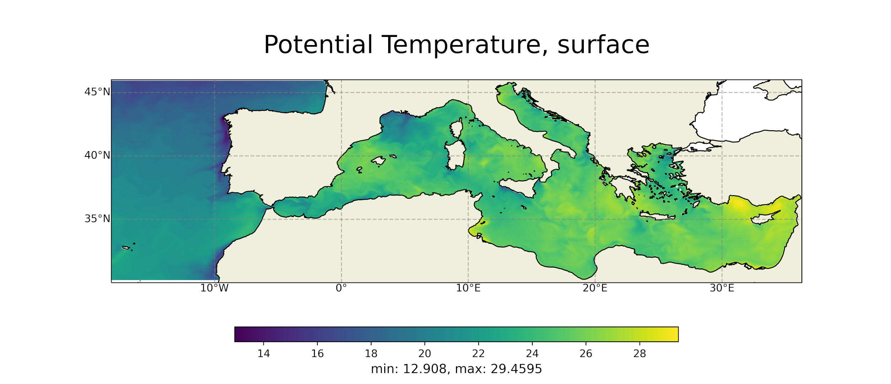
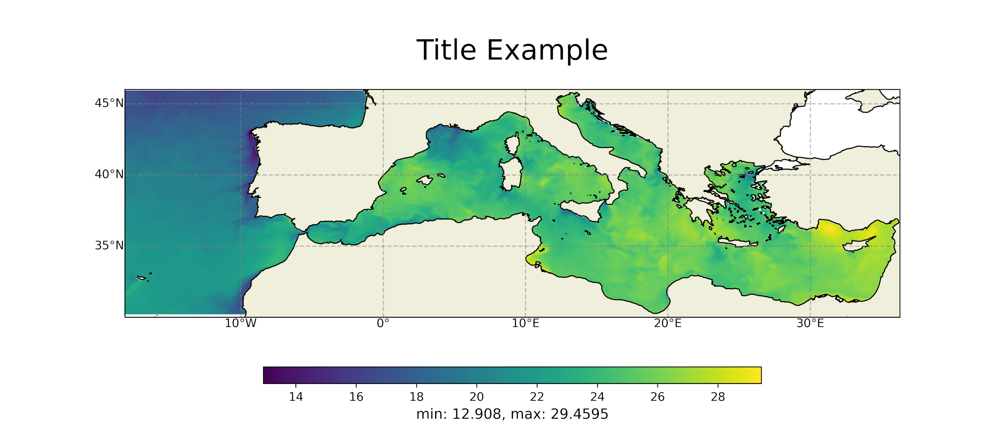
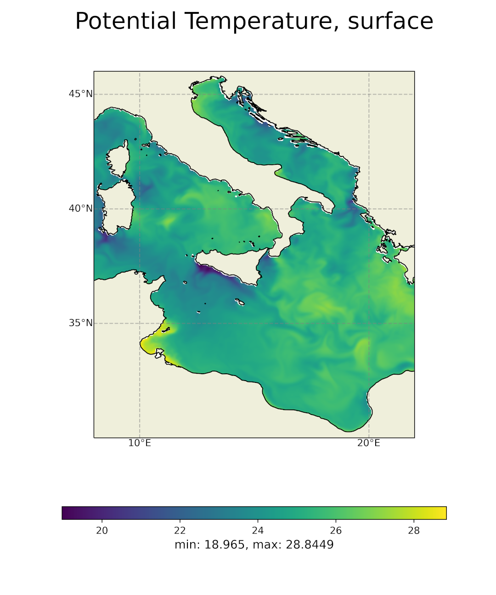
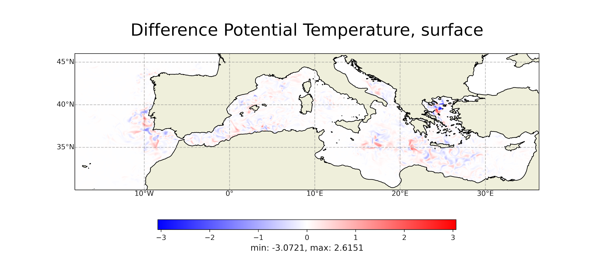
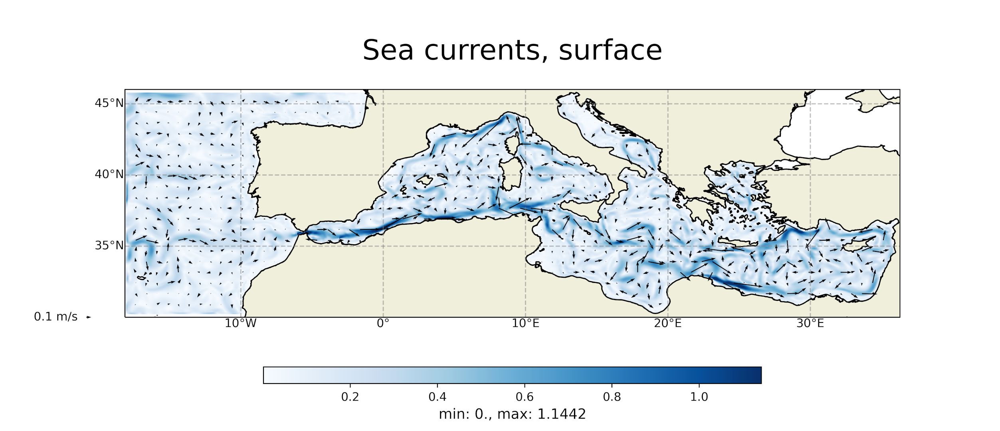

# Map - Timeseries plotting tool
### Quick guide

With this tool is possible to plot a map or a timeseries starting from a netCDF file.

To start the tool use the **ncplot.py** script:
```
usage: ncplot.py [-h] [--title TITLE] [--tDescr TDESCR] [--o OUTFILENAME] [--depthLevel DEPTHLEVEL]
                 [--lonLat LONLAT] [--grid GRID] [--mapLevels MAPLEVELS] [--clbLim CLBLIM] [--freq FREQ]
                 [--xTicks XTICKS] [--diff] [--diffMask] [--diffForce] [--i2 INPUTFILE2] [--curr]
                 [--qd QD] [--qScale QSCALE] [--qWidth QWIDTH] [--var2 VAR2] [--map] [--ts] [--clim]
                 [--timeRange TIMERANGE] [--climatology]
                 inputFile var

Map - Timeseries plotting tool

positional arguments:
  inputFile             Path of file
  var                   Variable to plot

optional arguments:
  -h, --help            show this help message and exit
  --title TITLE         Title
  --tDescr TDESCR       Title description
  --o OUTFILENAME       Outfile name
  --depthLevel DEPTHLEVEL
                        Depth level, surface by default
  --lonLat LONLAT       Map coordinates
  --grid GRID           Map grid size
  --mapLevels MAPLEVELS
                        How many colors represent in the map
  --clbLim CLBLIM       Set statically the color bar limit
  --freq FREQ           NetCDF4 data frequency
  --xTicks XTICKS       Ticks number on x axis
  --diff                Enable difference map mode
  --diffMask            Enable mask-difference map mode
  --diffForce           Try this command if some differences are not shown in the map
  --i2 INPUTFILE2       Path of second input file
  --curr                Enable currents map mode
  --qd QD               Quiver density
  --qScale QSCALE       Quiver scale, the lower the value the greater the quiver length
  --qWidth QWIDTH       Quiver width
  --var2 VAR2           Second variable in current map
  --map                 Enable map plot mode
  --ts                  Enable timeseries plot mode
  --clim                Enable climatology plot mode
  --timeRange TIMERANGE
                        Climatology timeseries time range
  --climatology         Enable climatology timeseries mode


```
The tool is able to detect automatically map or timeseries mode, but in case of need
it is possible to force one method with these flag:
1. **--map** to enable Map plot
2. **--ts** to enable Timeseries plot


## Map Plot guide
### Standard Map plot

To plot a map of ***var*** variable from ***inputfile*** use: 

```python ncplot.py inputfile var```

the result will be:




To choose the title of fig use ```--title``` argument:

```python ncplot.py inputfile var --title "Title Example" ```



### Lon-Lan selection
It is possible to choose the region in the plot specifying the coordinates with ```--lonLat [x1, x2, y1,y2]``` argument,
where **x1,x2** are the min and max of longitude and **y1,y2** the analogue for latitude':

```python ncplot.py inputfile var --lonLat "[8, 22, 30, 46]"```




### Difference plot

It is possible to use this tool in order to obtain a difference plot for the variable 
***var*** between two different files ***inputfile1*** and ***inputfile2***.
To activate the diff mode use the `--diff` argument. 
The syntax is the following:

```python ncplot.py inputfile1 var --diff --i2 inputfile2 --title "Diff plot"```



With the option **--diffMask** will be plotted the difference between the mask of the two files. \
With the option **--diffForce** you can obtain the difference between the points that in a file are
masked and in the other are not masked

### Currents plot

This tool supports the currents plot starting from ***u*** and ***v*** vector
components. \
To enable it, use the flag ```--curr```, then pass the ***inputfile*** that contain the two components,
then with ***var*** indicate the **u** component, with ```-var2``` the **v** component.
The syntax is the following:

```python ncplot.py inputfile1 ucomponent --curr  --var2 vcomponent```

You can also pass the v component with a second file in this way:

```python ncplot.py inputfile1 ucomponent --curr --i2 inputfile2 --var2 vcomponents```

##### Attention: the first file must contain the u component and the second the v component



In currents plot it is possibile to set the density, length and width of the quiver using 
the parameters ```--qd, --qScale, --qWidth```


## Timeseries Plot

The syntax is the same of the standard map:

```python ncplot.py inputfile var```

the result will be:


Also in this case we can choose the title of fig using `--title` argument (or the output file name 
using the argument `--o`).

### Climatology Timeseries Plot

In case of climatology timeseries use the flag --clim` in order to set the correct
label on x axis.

The syntax is the following:

```python ncplot.py inputfile var --clim```

the result will be:


